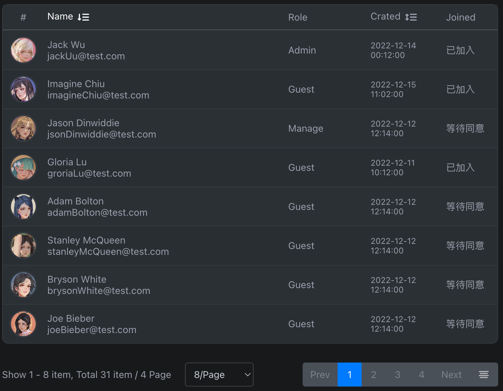

# bear-react-table

> Datepicker library based for Reactjs

[](https://www.npmjs.com/package/bear-react-table)
[](https://www.npmjs.com/package/bear-react-table)




## Support Version Map

React | React Scripts | Bear React Grid | 
------|:--------------|----------------:|
18    | 5.0.1         |           2.0.0 |


## Install

```bash
yarn add bear-react-table
```

## Usage

add in your index.tsx
```tst
import "bear-react-table/dist/index.css";

```

then in your page
```tsx
import {Table} from 'bear-react-table';


const getPageData = (currentPage: number, pageLimit: number) => {
    const pageStart = (currentPage -1) * pageLimit;
    return data.slice(pageStart, pageStart + pageLimit );
}


const BaseUsed = () => {

    const [isFetching, setIsFetching] = useState(false);
    const [paginateMeta, setPaginateMeta] = useState<IPaginateMeta>({
        currentPage: 1,
        pageLimit: 8,
        sort: {field: 'name', orderBy: 'DESC'},
    });
    const [paginateData, setPaginateData] = useState<IPaginateData[]>(getPageData(paginateMeta.currentPage, paginateMeta.pageLimit));
    const [paginateInfo, setPaginateInfo] = useState<IPaginateInfo>({
        totalItems: data.length,
        totalPages: Math.ceil(data.length / paginateMeta.pageLimit),
    });


    /**
     * 查詢分頁
     */
    const handleFetchPaginate = useCallback((meta: IPaginateMeta) => {
        // 取得查詢項目
        setIsFetching(true);
        setPaginateMeta(meta);

        setTimeout(() => {
            setPaginateData(getPageData(meta.currentPage, meta.pageLimit));
            setIsFetching(false);
        }, 400);
    }, []);


    return <div className="d-flex flex-row my-2">
        <Table
            isFetching={isFetching}
            title={[
                {text: '#',          field: 'avatar',      col: 60, titleAlign: 'center', dataAlign: 'center'},
                {text: 'Name',       field: 'name',        col: true, isEnableSort: true},
                {text: 'Role',       field: 'role',        col: 120},
                {text: 'Crated',     field: 'createdAt',   col: 110, isEnableSort: true},
                {text: 'Joined',     field: 'isApplyJoin', col: 80},
            ]}
            data={paginateData.map(row => {
                const createdAt = dayjs(row.createdAt);

                return {
                    ...row,
                    id: row.id,
                    disabled: !row.isJoined,
                    avatar: <Avatar style={{backgroundImage: `url(${row.avatar})`}}/>,
                    name: <div className="d-flex flex-column">
                        <div>{row.name}</div>
                        <div>{row.email}</div>
                    </div>,
                    isApplyJoin: row.isJoined ? '已加入':'等待同意',
                    createdAt: <div style={{fontSize: 12}}>
                        {createdAt.format('YYYY-MM-DD')}<br/>
                        {createdAt.format('HH:mm:ss')}
                    </div>,
                };
            })}
            onChangePage={handleFetchPaginate}
            paginateMeta={paginateMeta}
            paginateInfo={paginateInfo}
        />

    </div>

};
```


There is also a codesandbox template that you can fork and play with it:

[](https://codesandbox.io/s/bear-react-table-n0s8su?file=/src/App.tsx)


## License

MIT © [imagine10255](https://github.com/imagine10255)
