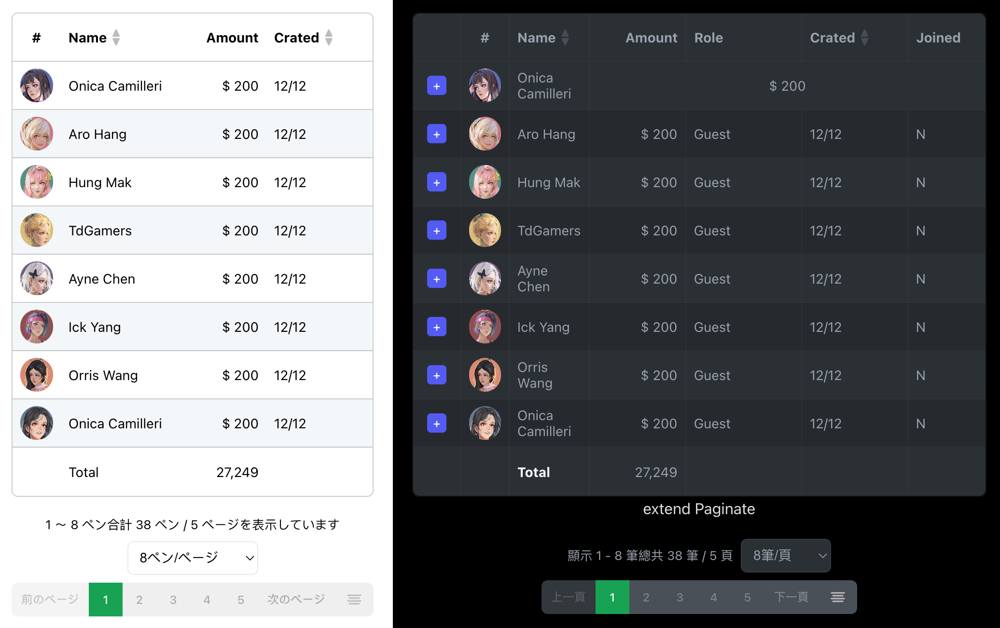

# Acrool React Table



<p align="center">
    CSS Gird Of React Table Design
</p>

<div align="center">

[](https://www.npmjs.com/package/@acrool/react-table)
[](https://www.npmjs.com/package/@acrool/react-table)
[](https://www.npmjs.com/package/@acrool/react-table)
[](https://github.com/acrool/acrool-react-table/blob/main/LICENSE)
</div>

## Documentation

- [Getting Started](https://acrool-react-table.pages.dev/docs/getting-started)
- [Faq](https://acrool-react-table.pages.dev/docs/category/faqs)
- [Components](https://acrool-react-table.pages.dev/docs/category/components)
- [Features](https://acrool-react-table.pages.dev/docs/category/features)


## Installation

```bash
yarn add @acrool/react-table
```

## Usage

add in your main.tsx
```tst
import '@acrool/react-table/dist/index.css';
```

## Option theme

add in your main.tsx, after dist/index.css

- Acrool
  - import '@acrool/react-table/dist/theme/acrool.css';
- Game
  - import '@acrool/react-table/dist/theme/game.css';

then in your page
```tsx
import AcroolTable from '@acrool/react-table';


const data = [
    {id: 1, text: 'Imagine', avatar: 'https://acrool-react-table.pages.dev/img/avatar/female-1.jpg'},
    {id: 1, text: 'Gary', avatar: 'https://acrool-react-table.pages.dev/img/avatar/female-2.jpg'},
    {id: 1, text: 'Selin', avatar: 'https://acrool-react-table.pages.dev/img/avatar/female-3.jpg'},
    {id: 1, text: 'Amy', avatar: 'https://acrool-react-table.pages.dev/img/avatar/female-4.jpg'},
    {id: 1, text: 'Keria', avatar: 'https://acrool-react-table.pages.dev/img/avatar/female-5.jpg'},
];

const BaseUsed = () => {
    
    const renderTable = () => {
        return <AcroolTable
            title={{
                avatar:   {text: '#',      col: 50,      titleAlign: 'center', dataAlign: 'center'},
                name:     {text: 'Name',   col: 'auto',  isEnableSort: true},
            }}
            data={data.map(row => {
                return {
                    id: row.id,
                    field: {
                        avatar: <Avatar src={row.avatar}/>,
                        name: row.name,
                    },
                };
            })}
        />;
    }
    
    return <div>
        {renderTable()}
    </div>;
};


const getPageData = (currentPage: number, pageLimit: number, order?: {orderField: string, orderBy: string}) => {

    if(order){
        data.sort((a, b) => mockSort(order.orderBy, order.orderField, a,b));
    }

    const pageStart = (currentPage -1) * pageLimit;
    return data.slice(pageStart, pageStart + pageLimit );
};


const BasePag = () => {
    const [paginateMeta, setPaginateMeta] = useState<IPaginateMeta>({
        currentPage: 1,
        pageLimit: 8,
        order: {
            orderField: 'id',
            orderBy: 'DESC',
        }
    });
    const [paginateData, setPaginateData] = useState<IPaginateData[]>(getPageData(paginateMeta.currentPage, paginateMeta.pageLimit, paginateMeta.order));

    
    const paginateInfo = {
        totalItems: data.length,
        totalPages: Math.ceil(data.length / paginateMeta.pageLimit),
    };
    
    const handleFetchPaginate: TOnChangePage = (meta) => {
        setIsFetching(true);
        setPaginateMeta(meta);

        const {currentPage, pageLimit, order} = meta;

        setTimeout(() => {
            setPaginateData(getPageData(currentPage, pageLimit, order));
            setIsFetching(false);
        }, 400);
    };
    
    return <Paginate
        isDark
        locale="zh-TW"
        meta={paginateMeta}
        info={paginateInfo}
        onChangePage={handleFetchPaginate}
    />;
};
```


There is also a codesandbox template that you can fork and play with it:

[](https://codesandbox.io/s/acrool-react-table-n0s8su?file=/src/App.tsx)


## License

MIT © [imagine10255](https://github.com/imagine10255)
